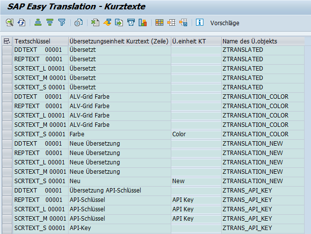
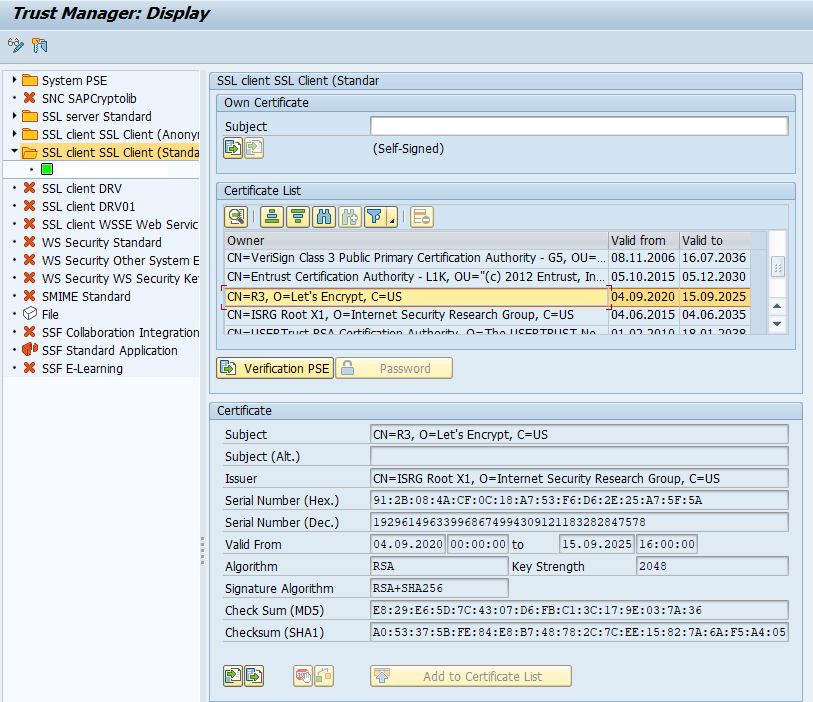
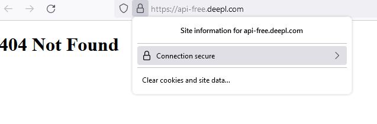
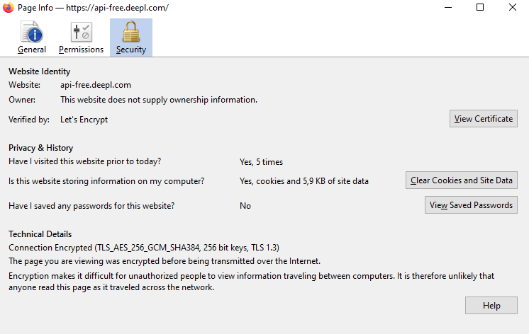
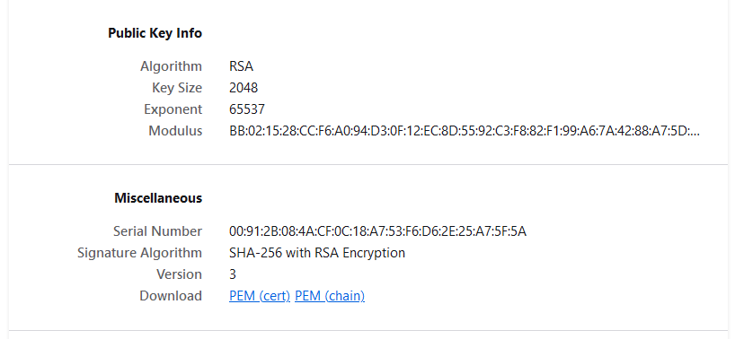
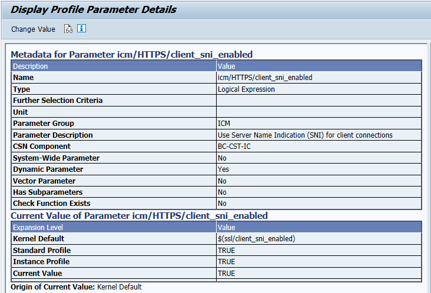

# SAP Easy Translation
Provides the transaction ZTRANSLATOR to optimize and automate the translation of ABAP short-, long- and other texts.

## What is different to SE63?
We tweaked to UI and the algorithm to translate short texts. The UI reads all text phrases, which need to be translated.
The algorithm use the following steps to propose the target text phrase:
- proposals from SAP proposal pool
- similar texts from data elements (e.g. Plant is used in a UI label -> translation is read from data element `WERKS_D`)
- Deepl-API

Every step can be enabled or disabled.

The UI shows the text in an editable ALV-Grid to review the proposals or to enter the translation manually.

## Setting up the DeepL-API
To setup the Deepl-API:
- Get a [API-Token](https://www.deepl.com/en/pro-api?cta=menu-pro-api)

- Download the CA certificates, that issued the certificate for https://api.deepl.com (Pro version) or https://api-free.deepl.com (Free version) and add them to transaction STRUST (Folder SSL client SSL Client (Standard)).

You can download the certificates when opening the URL in Mozilla Firefox and click on the lock icon,

next on the view certificate button

and then you see the certificate details + the download button to download the certificate

- Make sure SNI (Server Name Indication) is enabled (Parameter `icm/HTTPS/client_sni_enabled` in RZ11). Without SNI the SSL-Handshake can fail with the error code `SSSLERR_SERVER_CERT_MISMATCH`.

### Context
The DeepL-Api-Client uses the application component name of the ABAP package as context information. For Z- and Y-Packages make sure the application component is assigned to get proper results.

## Installation
The following requirements are needed:
- [abapGit](https://github.com/larshp/abapgit)
- SAP Basis 7.40 or higher
